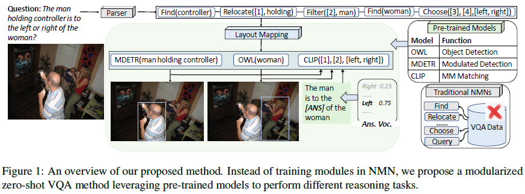

# Modularized Zero-shot VQA with Pre-trained Models

This includes an original implementation of "[Modularized Zero-shot VQA with Pre-trained Models][paper]" by Rui Cao, Jing Jiang.

<p align="center">
  
</p>

This code provides:
- Codes for pre-processing VQA datasets.
- Instructions and codes to run the models and get numbers reported in main experiment of the paper.

Please leave issues for any questions about the paper or the code.

If you find our code or paper useful, please cite the paper:
```
@inproceedings{cao-jiang-2023-modularized,
    title = "Modularized Zero-shot {VQA} with Pre-trained Models",
    author = "Cao, Rui  and
      Jiang, Jing",
    booktitle = "Findings of the Association for Computational Linguistics: ACL 2023",
    year = "2023",
    publisher = "Association for Computational Linguistics",
    pages = "58--76"
}
```

### Announcements
05/2023: Our paper is accepted by ACL, Findings 2023. 

## Content
1. [Installation](#installation)
2. [Dataset Prep-processing](#dataset-pre-processing)
    * [Step 1: Downloading Datasets](#step-1-downloading-datasets) (Section 4.1 of the paper) 
    * [Step 2: Layout Generation](#step-2-layout-generation) (Appendix F)
    * [Step 3: Object Detection](#step-3-object-detection) (Section 3.3 of the paper)
    * [Step 4: Masked Statement Generation for Open-ended Questions](#step-4-masked-statement-generation-for-open-ended-questions) (Section 3.3 of the paper)
    * [Step 5: Candidate Answers Generation](#step-4-candidate-answers-generation) (Appendix G) 
3. [Experiments](#experiments) (Section 4 of the paper)
    * [Testing on GQA](#testing-on-GQA)
    * [Testing on VQA](#testing-on-VQA)

## Installation
The code is tested with python 3.8. To run the code, you should install the package of transformers provided by Huggingface. The code is implemented with the CUDA of 11.2 (you can also implement with other compatible versions) and takes one Tesla V 100 GPU card (with 32G dedicated memory) for experiments. To run the experiments, we rely on the following packages: PyTorch (version 1.9.0), HuggingFace Transformers (version 4.19.2), Stanza (version 1.4.0) and NLTK (version 3.2.5). We also used pre-trained models as modules in our modularized networks. The following pre-trained models are considered: [OWL][owl_code], [MDETR][mdetr_code] and [CLIP][clip_code]. 

###
## Dataset Prep-processing

### Step 1: Downloading Datasets
To leverage our code, you need to download the testing data. We tested on two VQA benchmarks: [VQAv2][vqav2] and [GQA][gqa]. Both datasets are publicly available. Then you can apply our pre-processing code over the downloaded datasets.

### Step 2: Layout Generation
The layout generation step is to generate sub-reasoning tasks based on a given question. For instance, as shown in Figure 1 of our paper, the question *The man holding controller is to the left or right of the woman?* is converted to the layout: *Find(controller)--Relocate([1], holding)--Filter([2], man)--Find(woman)--Choose([3], [4], [left,right])*. More details of the rationale behind layout generation can be found in the paper: [Neural Module Netowkrs][nmn_paper].

To conduct layout generation, for the GQA dataset, we adopt the generation method from the paper: [Meta Module Network for Compositional Visual Reasoning][meta_nmn_paper]. It is a coarse-to-fine sequence-to-sequence model which generates module names at the first state and generates arguement for modules in the second stage. You can download the generated raw layouts from [MetaNMN][metanmn_code]. The raw layouts should also be mapped into our desired layouts (indicated in Section 3.3 in our paper). We provide the converted layout for GQA in [layouts/dep_all_meta_layout.pkl](layouts/dep_all_meta_layout.pkl). The converted lalyout for VQA is in [layouts/VQA](layouts/VQA).

### Step 3: Object Detection
The *Find* module calls for the capability of object detection. We leverage the off-the-shelf object detector [OWL][owl_code] for the purpose. For the counting and existent related questions, we pre-process (i.e., detect relevant objects to the question) and save the results. The code for object detection was provided in [obj_det_owl](obj_det_owl), which are used as illustrations about how to leverage the owl model for detection. Please make sure **File path is set correctly!!! the code for the model (the scenic folder) is set properly!!!!**. We also provide the results for object detection. Please feel free to contact us if needed as it exceeds the size of files for uploading.

### Step 4: Masked Statement Generation for Open-ended Questions
For open-ended questions, we follow [CLIPFew][clipfew_paper] to filter out less possible words and obtain a set of most possible answer candidates for questions. It contains two steps. The first step is to convert the questions into masked statement. The second step is to rank top-K possible words for the masked position. The masked templates is generated follow [CLIPFew][clipfew_paper]. The masksed templates for VQA is in the *clip_vqa* folder. The masked templates for GQA is in the *clip_gqa* folder.

### Step 5: Candidate Answers Generation
Based on the masked templates obtained in the previous step, the top-K possible answer candidates are generated with the help of the T5 model. The process is the same as the [CLIPFew][clipfew_paper] paper. Due to the limitation of file size, please reach out to use if in need of the files for answer candidates. We also provide hints about how to use T5 for generating answer candidates in the *clip_gqa* folder, the *.ipynb* code.

## Experiments 
We conducted experiments on two benchmakrs: VQAv2 and GQA.

### Testing on GQA
Please try our code provided in *Zero-Mod-on-GQA*, regarding choose, query, verify, logical and compare type of questions.

### Testing on VQA
Please try our code provided in *Zero-Mod-on-VQA*, regarding open-ended, binary and number related questions.

[paper]: https://aclanthology.org/2023.findings-acl.5.pdf
[owl_code]: https://github.com/google-research/scenic/tree/main/scenic/projects/owl_vit
[mdetr_code]: https://github.com/ashkamath/mdetr
[clip_code]: https://github.com/openai/CLIP
[vqav2]: https://visualqa.org/
[gqa]: https://cs.stanford.edu/people/dorarad/gqa/about.html
[nmn_paper]: https://arxiv.org/abs/1511.02799
[meeta_nmn_paper]: https://openaccess.thecvf.com/content/WACV2021/papers/Chen_Meta_Module_Network_for_Compositional_Visual_Reasoning_WACV_2021_paper.pdf
[metanmn_code]: https://github.com/wenhuchen/Meta-Module-Network
[clipfew_paper]: https://aclanthology.org/2022.acl-long.421.pdf
